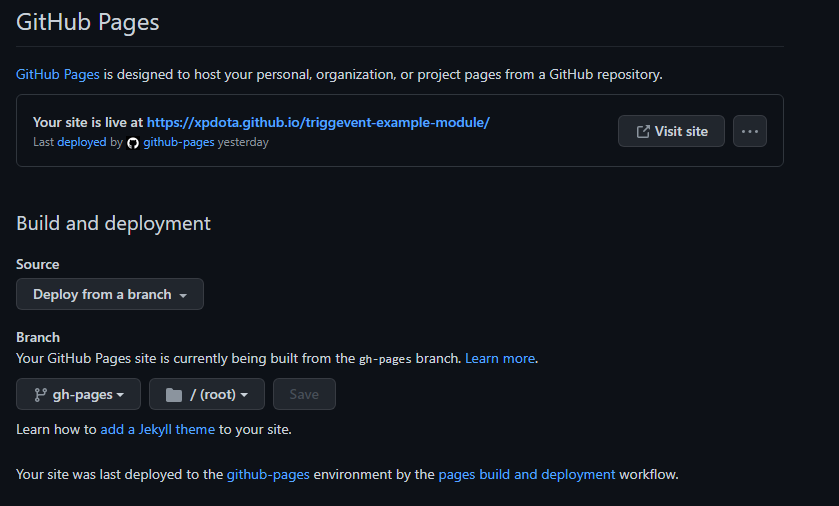
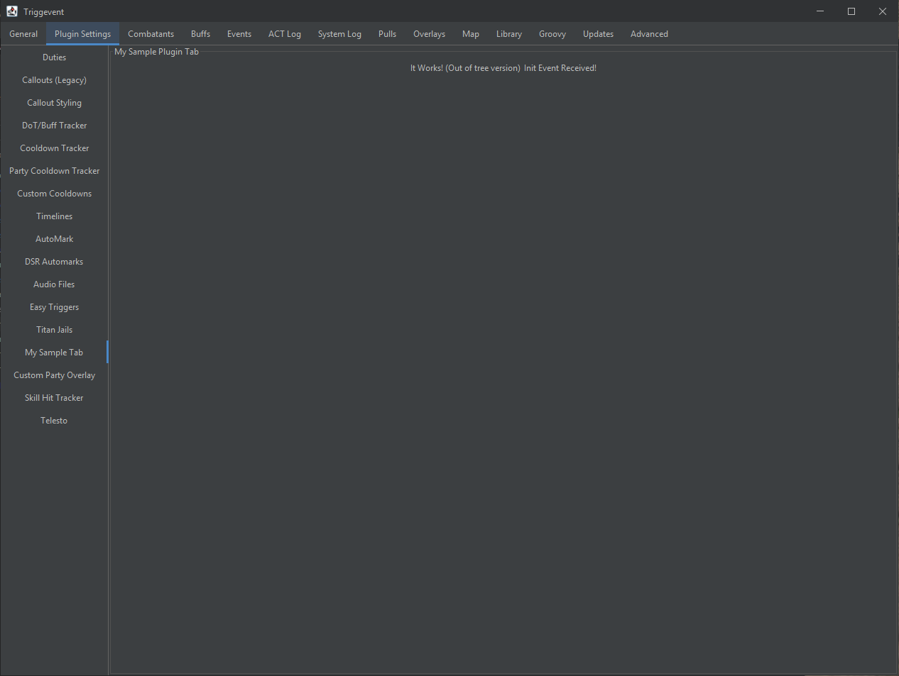

# Example Addon for [Triggevent](https://github.com/xpdota/event-trigger/)

This project is an example of how to make a standalone addon for Triggevent.

It includes all necessary build scripts and Github workflows to publish it.

To create and publish your own module, make your own fork or copy of this project, and do the following:

1. Clone or copy this project.
1. In the pom.xml, change the artifact ID to a good and unique name for your project. You may want to add your nickname to make sure it's unique (e.g. 'johns-ucob-triggers').
2. Check out the main Triggevent sources, and do one of the following:
    - Do a `mvn clean install` of triggevent so that the build JARs are available in your local maven repository.
    - In IntelliJ, use File -> New -> "Module from Existing Sources..." and add the Triggevent sources as a module.
      This is the preferred option, as it allows you to explore and edit the real Triggevent sources as if they were
      part of your own project.
      If you do this, you may wish to hide Triggevent's git root in File -> Settings -> Version Control -> Directory 
      Mappings by changing the directory's VCS to 'none'.

3. In your Github project under Settings -> Actions -> General, ensure that Github actions are allowed.
4. After you commit and push once, make sure the Github Action workflow was successful.
5. In your Github project under Settings -> Pages, configure it as such:


If all of this worked, you should be able to reach your manifest file 
at `https://$(username).github.io/$(project name)/$(git branch)/manifest`
e.g. [https://xpdota.github.io/triggevent-example-module/master/manifest](https://xpdota.github.io/triggevent-example-module/master/manifest).

The manifest file is simply a mapping of file hashes to files. 

You should only include your own code and dependencies which are not already included in the base Triggevent.
Everything must be in JARs.

Triggevent's UI for managing addons is still under construction, but you can preview the backend functionality by doing
the following:

1. Switch to the addon-support-phase1 branch.
2. In your updater.properties, add a new line, pointing to your files, but replace 'manifest' with '%s'
   (the rest of the files must be in the same directory): 
```
addons=name-of-addon:https://website.com/path/to/addon/directory/%s
```
3. Auto-update as you normally would.

For example, if you were to add this addon (`addons=test-addon:https://xpdota.github.io/triggevent-example-module/master/%s`), and
run the updater, you would see a tab like this:



The JAR file is placed in `addon/test-addon` (relative to the install dir). 

## Testing/Debugging your Addon Before Publishing

This project comes with an IntelliJ run profile, simply called 'run', which should launch
Triggevent with your addon loaded.